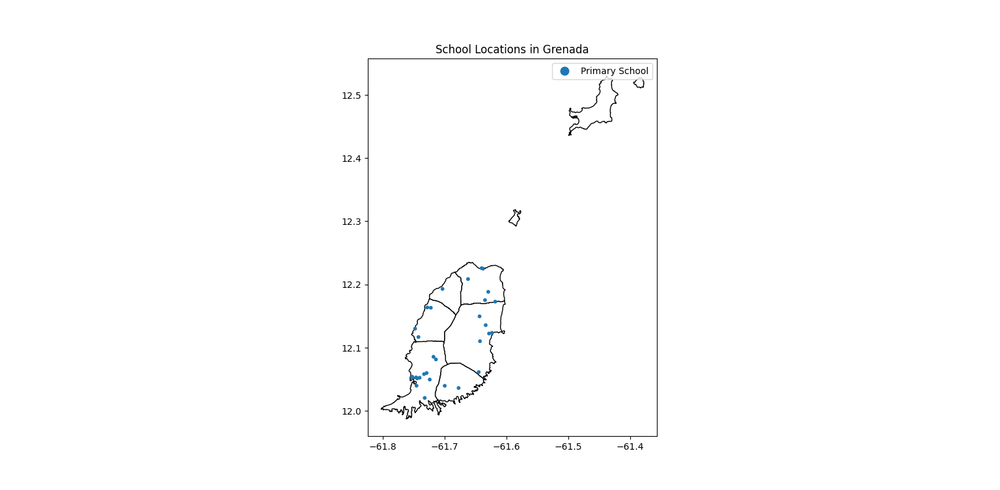

**This GitHub repository (<https://github.com/Genymobile/scrcpy>) is the source code for all my GIS analyses.**

 `GIS`.

# Project: School Locations

This script displays a shapefile of the geospatial boundaries of mainland Grenada, and overlays the locations of all primary schools on the island. It works on _Linux_, _Windows_ and _macOS_.

## Get the Script

 - [Link](https://github.com/jtkrohm/GIS/blob/main/geopandas_schools_plot.py)
